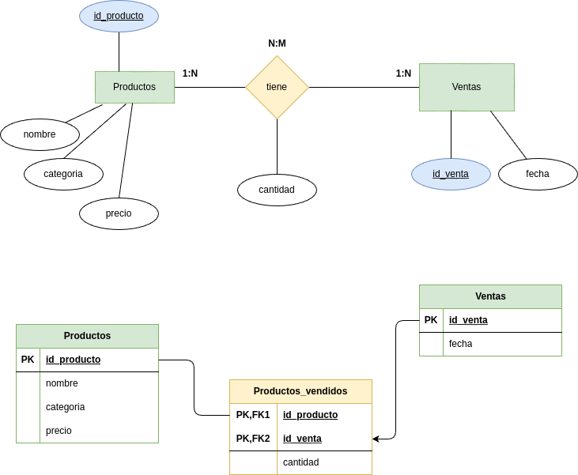

<div align="justify">

# Unidad-5-tarea-4 sobre Creación y manipulación en SQLite3 desde línea de comandos.


### Paso 1: Creación de la BBDD

Crea con el siguente contenido el fichero __supermercado-dump.sql__.

```sql
CREATE TABLE productos (
    id INTEGER PRIMARY KEY,
    nombre TEXT,
    categoria TEXT,
    precio REAL
);

CREATE TABLE ventas (
    id INTEGER PRIMARY KEY,
    id_producto INTEGER,
    cantidad INTEGER,
    fecha DATE,
    FOREIGN KEY (id_producto) REFERENCES productos(id)
);

INSERT INTO productos (id, nombre, categoria, precio) VALUES 
    (1, 'Arroz', 'Alimentos', 2.5),
    (2, 'Leche', 'Lácteos', 1.8),
    (3, 'Pan', 'Panadería', 1.2),
    (4, 'Manzanas', 'Frutas', 3.0),
    (5, 'Pollo', 'Carnes', 5.5),
    (6, 'Huevos', 'Lácteos', 1.0),
    (7, 'Yogurt', 'Lácteos', 2.0),
    (8, 'Tomates', 'Verduras', 2.2),
    (9, 'Queso', 'Lácteos', 4.0),
    (10, 'Cereal', 'Desayuno', 3.5),
    (11, 'Papel Higiénico', 'Hogar', 1.5),
    (12, 'Cepillo de Dientes', 'Higiene', 2.0),
    (13, 'Detergente', 'Limpieza', 2.8),
    (14, 'Galletas', 'Snacks', 1.7),
    (15, 'Aceite de Oliva', 'Cocina', 4.5),
    (16, 'Café', 'Bebidas', 5.0),
    (17, 'Sopa enlatada', 'Conservas', 2.3),
    (18, 'Jabón de Baño', 'Higiene', 1.2),
    (19, 'Botellas de Agua', 'Bebidas', 1.0),
    (20, 'Cerveza', 'Bebidas', 3.8);

INSERT INTO ventas (id_producto, cantidad, fecha) VALUES 
    (1, 5, '2024-01-17'),
    (2, 3, '2024-01-17'),
    (4, 2, '2024-01-17'),
    (5, 1, '2024-01-17'),
    (6, 10, '2024-01-18'),
    (8, 4, '2024-01-18'),
    (10, 2, '2024-01-18'),
    (14, 7, '2024-01-19'),
    (16, 3, '2024-01-19'),
    (18, 6, '2024-01-20');
```

Creando el fichero empleados-dump.sql desde VSCode:

<div align="center">

</div>
  
### Paso 2 Lectura del fichero sql.

Entra en sqlite a través del siguiente comando:

```sql
sqlite3 tarea4.db 
```

Haciendo un __.read__ del fichero __sql__, de nombre __supermercado-dump.sql__, realiza la creación e inserción de información de la __BBDD__.

    ```
        ~/Escritorio/BAE tareas SQLite/Unidad-5-tarea-4$ sqlite3 tarea4.db
        SQLite version 3.37.2 2022-01-06 13:25:41
        Enter ".help" for usage hints.
        sqlite> .mode table
        sqlite> .read supermercado-dump.sql
        sqlite> .table
        productos  ventas   
        sqlite> 
    ```

***

### Paso 3: Responde a las siguientes cuestiones

- Realiza el diagrama __ER__ de la __BBDD__ supermercado.

<div align="center">

</div>


- Realiza el diagrama __MR__ de la __BBDD__ supermercado.

   - Ver las tablas en la imagen del ejercicio anterior.

- Indica si la BBDD esta __normalizada__ hasta la 3ª forma normal, justificando la respuesta.

    - La BBDD puede que los datos sean atómicos cumpliendo con la 1FN. Al aplicarse la 2FN no deben exitir dependencias parciales (atributos no clave que dependan completamente de la PK), tanto ventas como productos no ofrecen de dependencias parciales (fecha y cantidad dependen de venta). Ahora bien, considero que una tercera tabla en el que se reflejen los productos_vendidos sí aportaría más solidez ofreciendo información más detallada sobre las ventas del supermercado.
    Al llegar a la 3FN no deben haber dependencias transitivas. En la tabla Productos, los atributos dependen de la id_producto y no entre sí. Mientras tanto, en la tabla Ventas, cantidad y fecha parecen depender de la id y no entre sí.
    Ahora bien, con la inclusión de una tercera tabla (productos_vendidos) se pueden hacer más flexibles para, por ejemplo, añadir promociones de los productos (que suele ser habitual en los supermercados). Además, se podría repetir el nombre del producto o el precio cada vez que hubiese una venta con el riesgo de generar una redundancia de datos. Con la propuesta de la tabla intermedia (productos_vendidos) se podría mejorar la BBDD para llegar a la 3FN de manera más eficiente.


***

### Paso 4: Responde a las siguientes cuestiones

Realiza las siguientes consultas, y muestra el resultado obtenido:

- Mostrar todos los productos de la categoría "Bebidas".

    ```
        sqlite> SELECT * FROM productos WHERE categoria = 'Bebidas';
        +----+------------------+-----------+--------+
        | id |      nombre      | categoria | precio |
        +----+------------------+-----------+--------+
        | 16 | Café             | Bebidas   | 5.0    |
        | 19 | Botellas de Agua | Bebidas   | 1.0    |
        | 20 | Cerveza          | Bebidas   | 3.8    |
        +----+------------------+-----------+--------+
        sqlite>
    ```

- Listar los productos ordenados por precio de forma descendente.


    ```
        sqlite> SELECT * FROM productos ORDER BY precio DESC;
        +----+--------------------+-----------+--------+
        | id |       nombre       | categoria | precio |
        +----+--------------------+-----------+--------+
        | 5  | Pollo              | Carnes    | 5.5    |
        | 16 | Café               | Bebidas   | 5.0    |
        | 15 | Aceite de Oliva    | Cocina    | 4.5    |
        | 9  | Queso              | Lácteos   | 4.0    |
        | 20 | Cerveza            | Bebidas   | 3.8    |
        | 10 | Cereal             | Desayuno  | 3.5    |
        | 4  | Manzanas           | Frutas    | 3.0    |
        | 13 | Detergente         | Limpieza  | 2.8    |
        | 1  | Arroz              | Alimentos | 2.5    |
        | 17 | Sopa enlatada      | Conservas | 2.3    |
        | 8  | Tomates            | Verduras  | 2.2    |
        | 7  | Yogurt             | Lácteos   | 2.0    |
        | 12 | Cepillo de Dientes | Higiene   | 2.0    |
        | 2  | Leche              | Lácteos   | 1.8    |
        | 14 | Galletas           | Snacks    | 1.7    |
        | 11 | Papel Higiénico    | Hogar     | 1.5    |
        | 3  | Pan                | Panadería | 1.2    |
        | 18 | Jabón de Baño      | Higiene   | 1.2    |
        | 6  | Huevos             | Lácteos   | 1.0    |
        | 19 | Botellas de Agua   | Bebidas   | 1.0    |
        +----+--------------------+-----------+--------+
        sqlite>
    ```
    

- Calcular el precio total de todos los productos en la tabla "productos".


    ```
    sqlite> SELECT SUM(precio) AS precio_total FROM productos;
    +--------------+
    | precio_total |
    +--------------+
    | 52.5         |
    +--------------+
    sqlite> 

    ```
    
- Encontrar los productos con un nombre que contenga la letra 'a'.


    ```
    sqlite> SELECT * FROM productos WHERE nombre LIKE '%a%';
    +----+------------------+-----------+--------+
    | id |      nombre      | categoria | precio |
    +----+------------------+-----------+--------+
    | 1  | Arroz            | Alimentos | 2.5    |
    | 3  | Pan              | Panadería | 1.2    |
    | 4  | Manzanas         | Frutas    | 3.0    |
    | 8  | Tomates          | Verduras  | 2.2    |
    | 10 | Cereal           | Desayuno  | 3.5    |
    | 11 | Papel Higiénico  | Hogar     | 1.5    |
    | 14 | Galletas         | Snacks    | 1.7    |
    | 15 | Aceite de Oliva  | Cocina    | 4.5    |
    | 16 | Café             | Bebidas   | 5.0    |
    | 17 | Sopa enlatada    | Conservas | 2.3    |
    | 18 | Jabón de Baño    | Higiene   | 1.2    |
    | 19 | Botellas de Agua | Bebidas   | 1.0    |
    | 20 | Cerveza          | Bebidas   | 3.8    |
    +----+------------------+-----------+--------+
    sqlite> 

    ```
    
- Obtener la cantidad total de productos vendidos en todas las fechas.


    ```
    sqlite> SELECT SUM(cantidad) AS total_vendido FROM ventas;
    +---------------+
    | total_vendido |
    +---------------+
    | 43            |
    +---------------+
    sqlite>
    ```
    
- Encontrar el producto más caro en cada categoría.


    ```
    sqlite> SELECT categoria, MAX(precio) AS precio_maximo FROM productos GROUP BY categoria;
    +-----------+---------------+
    | categoria | precio_maximo |
    +-----------+---------------+
    | Alimentos | 2.5           |
    | Bebidas   | 5.0           |
    | Carnes    | 5.5           |
    | Cocina    | 4.5           |
    | Conservas | 2.3           |
    | Desayuno  | 3.5           |
    | Frutas    | 3.0           |
    | Higiene   | 2.0           |
    | Hogar     | 1.5           |
    | Limpieza  | 2.8           |
    | Lácteos   | 4.0           |
    | Panadería | 1.2           |
    | Snacks    | 1.7           |
    | Verduras  | 2.2           |
    +-----------+---------------+
    sqlite>
    ```
    
- Listar los productos que no han sido vendidos.


    ```
    sqlite> SELECT * FROM productos WHERE id NOT IN (SELECT id_producto FROM ventas);
    +----+--------------------+-----------+--------+
    | id |       nombre       | categoria | precio |
    +----+--------------------+-----------+--------+
    | 3  | Pan                | Panadería | 1.2    |
    | 7  | Yogurt             | Lácteos   | 2.0    |
    | 9  | Queso              | Lácteos   | 4.0    |
    | 11 | Papel Higiénico    | Hogar     | 1.5    |
    | 12 | Cepillo de Dientes | Higiene   | 2.0    |
    | 13 | Detergente         | Limpieza  | 2.8    |
    | 15 | Aceite de Oliva    | Cocina    | 4.5    |
    | 17 | Sopa enlatada      | Conservas | 2.3    |
    | 19 | Botellas de Agua   | Bebidas   | 1.0    |
    | 20 | Cerveza            | Bebidas   | 3.8    |
    +----+--------------------+-----------+--------+
    sqlite>

    ```
    
- Calcular el precio promedio de los productos en la categoría "Snacks".


    ```
    sqlite> SELECT AVG(precio) AS precio_promedio FROM productos WHERE categoria = 'Snacks';
    +-----------------+
    | precio_promedio |
    +-----------------+
    | 1.7             |
    +-----------------+
    sqlite>
    ```
    
- Encontrar los productos que han sido vendidos más de 5 veces.


    ```
    sqlite> SELECT id_producto, SUM(cantidad) AS total_vendido FROM ventas GROUP BY id_producto HAVING total_vendido > 5;
    +-------------+---------------+
    | id_producto | total_vendido |
    +-------------+---------------+
    | 6           | 10            |
    | 14          | 7             |
    | 18          | 6             |
    +-------------+---------------+
    sqlite> 

    ```
    
- Mostrar la fecha y la cantidad de ventas para cada producto.


    ```
    sqlite> SELECT fecha, id_producto, cantidad FROM ventas ORDER BY fecha;
    +------------+-------------+----------+
    |   fecha    | id_producto | cantidad |
    +------------+-------------+----------+
    | 2024-01-17 | 1           | 5        |
    | 2024-01-17 | 2           | 3        |
    | 2024-01-17 | 4           | 2        |
    | 2024-01-17 | 5           | 1        |
    | 2024-01-18 | 6           | 10       |
    | 2024-01-18 | 8           | 4        |
    | 2024-01-18 | 10          | 2        |
    | 2024-01-19 | 14          | 7        |
    | 2024-01-19 | 16          | 3        |
    | 2024-01-20 | 18          | 6        |
    +------------+-------------+----------+
    sqlite>
    ```
    
- Encontrar los productos que tienen un precio menor o igual a 2.


    ```
    sqlite> SELECT * FROM productos WHERE precio <= 2;
    +----+--------------------+-----------+--------+
    | id |       nombre       | categoria | precio |
    +----+--------------------+-----------+--------+
    | 2  | Leche              | Lácteos   | 1.8    |
    | 3  | Pan                | Panadería | 1.2    |
    | 6  | Huevos             | Lácteos   | 1.0    |
    | 7  | Yogurt             | Lácteos   | 2.0    |
    | 11 | Papel Higiénico    | Hogar     | 1.5    |
    | 12 | Cepillo de Dientes | Higiene   | 2.0    |
    | 14 | Galletas           | Snacks    | 1.7    |
    | 18 | Jabón de Baño      | Higiene   | 1.2    |
    | 19 | Botellas de Agua   | Bebidas   | 1.0    |
    +----+--------------------+-----------+--------+
    sqlite> 
    ```
    
- Calcular la cantidad total de ventas para cada fecha.

    ```
    sqlite> SELECT fecha, SUM(cantidad) AS total_vendido FROM ventas GROUP BY fecha;
    +------------+---------------+
    |   fecha    | total_vendido |
    +------------+---------------+
    | 2024-01-17 | 11            |
    | 2024-01-18 | 16            |
    | 2024-01-19 | 10            |
    | 2024-01-20 | 6             |
    +------------+---------------+
    sqlite> 

    ```
    
- Listar los productos cuyo nombre comienza con la letra 'P'.


    ```
    sqlite> SELECT * FROM productos WHERE nombre LIKE 'P%';
    +----+-----------------+-----------+--------+
    | id |     nombre      | categoria | precio |
    +----+-----------------+-----------+--------+
    | 3  | Pan             | Panadería | 1.2    |
    | 5  | Pollo           | Carnes    | 5.5    |
    | 11 | Papel Higiénico | Hogar     | 1.5    |
    +----+-----------------+-----------+--------+
    sqlite> 

    ```
    
- Obtener el producto más vendido en términos de cantidad.


    ```
        sqlite> SELECT id_producto, SUM(cantidad) AS total_vendido FROM ventas GROUP BY id_producto ORDER BY total_vendido DESC LIMIT 1;
        +-------------+---------------+
        | id_producto | total_vendido |
        +-------------+---------------+
        | 6           | 10            |
        +-------------+---------------+
        sqlite>
    ```
    
- Mostrar los productos que fueron vendidos en la fecha '__2024-01-18__'.

    ```
    sqlite> SELECT * FROM productos WHERE id IN (SELECT id_producto FROM ventas WHERE fecha = '2024-01-18');
    +----+---------+-----------+--------+
    | id | nombre  | categoria | precio |
    +----+---------+-----------+--------+
    | 6  | Huevos  | Lácteos   | 1.0    |
    | 8  | Tomates | Verduras  | 2.2    |
    | 10 | Cereal  | Desayuno  | 3.5    |
    +----+---------+-----------+--------+
    sqlite> 
    ```
    
- Calcular el total de ventas para cada producto.


    ```
        sqlite> SELECT id_producto, SUM(cantidad) AS total_vendido FROM ventas GROUP BY id_producto;
        +-------------+---------------+
        | id_producto | total_vendido |
        +-------------+---------------+
        | 1           | 5             |
        | 2           | 3             |
        | 4           | 2             |
        | 5           | 1             |
        | 6           | 10            |
        | 8           | 4             |
        | 10          | 2             |
        | 14          | 7             |
        | 16          | 3             |
        | 18          | 6             |
        +-------------+---------------+
        sqlite
    ```
    
- Encontrar los productos con un precio entre 3 y 4.

    ```
    sqlite> SELECT * FROM productos WHERE precio BETWEEN 3 AND 4;
    +----+----------+-----------+--------+
    | id |  nombre  | categoria | precio |
    +----+----------+-----------+--------+
    | 4  | Manzanas | Frutas    | 3.0    |
    | 9  | Queso    | Lácteos   | 4.0    |
    | 10 | Cereal   | Desayuno  | 3.5    |
    | 20 | Cerveza  | Bebidas   | 3.8    |
    +----+----------+-----------+--------+
    sqlite>
    ```
    
- Listar los productos y sus categorías ordenados alfabéticamente por categoría.


    ```
        sqlite> SELECT nombre, categoria FROM productos ORDER BY categoria ASC;
        +--------------------+-----------+
        |       nombre       | categoria |
        +--------------------+-----------+
        | Arroz              | Alimentos |
        | Café               | Bebidas   |
        | Botellas de Agua   | Bebidas   |
        | Cerveza            | Bebidas   |
        | Pollo              | Carnes    |
        | Aceite de Oliva    | Cocina    |
        | Sopa enlatada      | Conservas |
        | Cereal             | Desayuno  |
        | Manzanas           | Frutas    |
        | Cepillo de Dientes | Higiene   |
        | Jabón de Baño      | Higiene   |
        | Papel Higiénico    | Hogar     |
        | Detergente         | Limpieza  |
        | Leche              | Lácteos   |
        | Huevos             | Lácteos   |
        | Yogurt             | Lácteos   |
        | Queso              | Lácteos   |
        | Pan                | Panadería |
        | Galletas           | Snacks    |
        | Tomates            | Verduras  |
        +--------------------+-----------+
        sqlite> 
    ```
    
- Calcular el precio total de los productos vendidos en la fecha '2024-01-19'.

    ```
        sqlite> SELECT SUM(p.precio * v.cantidad) AS total_ventas FROM productos p JOIN ventas v ON p.id = v.id_producto WHERE v.fecha = '2024-01-19';
        +--------------+
        | total_ventas |
        +--------------+
        | 26.9         |
        +--------------+
        sqlite> 
    ```
    
- Mostrar los productos que no pertenecen a la categoría "__Higiene__".


    ```
        sqlite> SELECT * FROM productos WHERE categoria != 'Higiene';
        +----+------------------+-----------+--------+
        | id |      nombre      | categoria | precio |
        +----+------------------+-----------+--------+
        | 1  | Arroz            | Alimentos | 2.5    |
        | 2  | Leche            | Lácteos   | 1.8    |
        | 3  | Pan              | Panadería | 1.2    |
        | 4  | Manzanas         | Frutas    | 3.0    |
        | 5  | Pollo            | Carnes    | 5.5    |
        | 6  | Huevos           | Lácteos   | 1.0    |
        | 7  | Yogurt           | Lácteos   | 2.0    |
        | 8  | Tomates          | Verduras  | 2.2    |
        | 9  | Queso            | Lácteos   | 4.0    |
        | 10 | Cereal           | Desayuno  | 3.5    |
        | 11 | Papel Higiénico  | Hogar     | 1.5    |
        | 13 | Detergente       | Limpieza  | 2.8    |
        | 14 | Galletas         | Snacks    | 1.7    |
        | 15 | Aceite de Oliva  | Cocina    | 4.5    |
        | 16 | Café             | Bebidas   | 5.0    |
        | 17 | Sopa enlatada    | Conservas | 2.3    |
        | 19 | Botellas de Agua | Bebidas   | 1.0    |
        | 20 | Cerveza          | Bebidas   | 3.8    |
        +----+------------------+-----------+--------+
        sqlite> 

    ```
    
- Encontrar la cantidad total de productos en cada categoría.


    ```
    sqlite> SELECT categoria, COUNT(*) AS total_productos FROM productos GROUP BY categoria;
    +-----------+-----------------+
    | categoria | total_productos |
    +-----------+-----------------+
    | Alimentos | 1               |
    | Bebidas   | 3               |
    | Carnes    | 1               |
    | Cocina    | 1               |
    | Conservas | 1               |
    | Desayuno  | 1               |
    | Frutas    | 1               |
    | Higiene   | 2               |
    | Hogar     | 1               |
    | Limpieza  | 1               |
    | Lácteos   | 4               |
    | Panadería | 1               |
    | Snacks    | 1               |
    | Verduras  | 1               |
    +-----------+-----------------+
    sqlite> 
    ```
    
- Listar los productos que tienen un precio igual a la media de precios.

    ```
        sqlite> SELECT * FROM productos WHERE precio = (SELECT AVG(precio) FROM productos);
        qlite> 

    ```

- Calcular el precio total de los productos vendidos en cada fecha.


    ```
    sqlite> SELECT fecha, SUM(p.precio * v.cantidad) AS total_ventas FROM ventas v JOIN productos p ON v.id_producto = p.id  GROUP BY fecha;
    +------------+--------------+
    |   fecha    | total_ventas |
    +------------+--------------+
    | 2024-01-17 | 29.4         |
    | 2024-01-18 | 25.8         |
    | 2024-01-19 | 26.9         |
    | 2024-01-20 | 7.2          |
    +------------+--------------+
    sqlite> 
    ```
    
- Mostrar los productos con un nombre que termina con la letra 'o'.


    ```
        sqlite> SELECT * FROM productos WHERE nombre LIKE '%o';
        +----+-----------------+-----------+--------+
        | id |     nombre      | categoria | precio |
        +----+-----------------+-----------+--------+
        | 5  | Pollo           | Carnes    | 5.5    |
        | 9  | Queso           | Lácteos   | 4.0    |
        | 11 | Papel Higiénico | Hogar     | 1.5    |
        | 18 | Jabón de Baño   | Higiene   | 1.2    |
        +----+-----------------+-----------+--------+
        sqlite> 
    ```
    
- Encontrar los productos que han sido vendidos en más de una fecha.


    ```
    sqlite> SELECT p.nombre, COUNT(DISTINCT v.fecha) AS total_fechas FROM ventas v JOIN productos p ON v.id_producto = p.id GROUP BY v.id_producto HAVING COUNT(DISTINCT v.fecha) > 1;                                       
    sqlite> 

    ```
    
- Listar los productos cuya categoría comienza con la letra 'L'.

    ```
    sqlite> SELECT * FROM productos WHERE categoria LIKE 'L%';
    +----+------------+-----------+--------+
    | id |   nombre   | categoria | precio |
    +----+------------+-----------+--------+
    | 2  | Leche      | Lácteos   | 1.8    |
    | 6  | Huevos     | Lácteos   | 1.0    |
    | 7  | Yogurt     | Lácteos   | 2.0    |
    | 9  | Queso      | Lácteos   | 4.0    |
    | 13 | Detergente | Limpieza  | 2.8    |
    +----+------------+-----------+--------+
    sqlite> 
    ```
    
- Calcular el total de ventas para cada producto en la fecha '2024-01-17'.

    ```
    sqlite> SELECT p.nombre, SUM(v.cantidad) AS total_vendido FROM ventas v JOIN productos p ON v.id_producto = p.id WHERE v.fecha = '2024-01-17' GROUP BY p.nombre;
    +----------+---------------+
    |  nombre  | total_vendido |
    +----------+---------------+
    | Arroz    | 5             |
    | Leche    | 3             |
    | Manzanas | 2             |
    | Pollo    | 1             |
    +----------+---------------+
    sqlite> 

    ```
    
- Mostrar los productos cuyo nombre tiene al menos 5 caracteres.

    ```
    sqlite> SELECT * FROM productos WHERE LENGTH(nombre) >= 5;
    +----+--------------------+-----------+--------+
    | id |       nombre       | categoria | precio |
    +----+--------------------+-----------+--------+
    | 1  | Arroz              | Alimentos | 2.5    |
    | 2  | Leche              | Lácteos   | 1.8    |
    | 4  | Manzanas           | Frutas    | 3.0    |
    | 5  | Pollo              | Carnes    | 5.5    |
    | 6  | Huevos             | Lácteos   | 1.0    |
    | 7  | Yogurt             | Lácteos   | 2.0    |
    | 8  | Tomates            | Verduras  | 2.2    |
    | 9  | Queso              | Lácteos   | 4.0    |
    | 10 | Cereal             | Desayuno  | 3.5    |
    | 11 | Papel Higiénico    | Hogar     | 1.5    |
    | 12 | Cepillo de Dientes | Higiene   | 2.0    |
    | 13 | Detergente         | Limpieza  | 2.8    |
    | 14 | Galletas           | Snacks    | 1.7    |
    | 15 | Aceite de Oliva    | Cocina    | 4.5    |
    | 17 | Sopa enlatada      | Conservas | 2.3    |
    | 18 | Jabón de Baño      | Higiene   | 1.2    |
    | 19 | Botellas de Agua   | Bebidas   | 1.0    |
    | 20 | Cerveza            | Bebidas   | 3.8    |
    +----+--------------------+-----------+--------+
    sqlite> 

    ```
    
- Encontrar los productos que tienen un precio superior al precio máximo en la tabla "__productos__".

    ```
    sqlite> SELECT * FROM productos WHERE precio > (SELECT MAX(precio) FROM productos);
    sqlite>
    ```
</div>