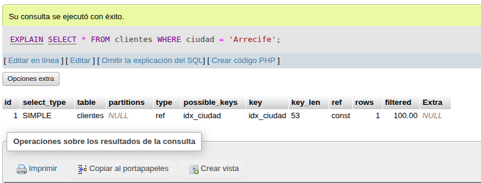
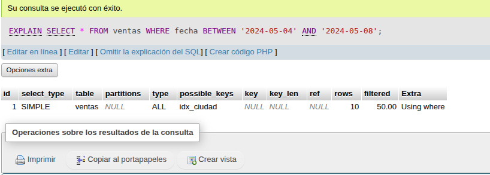
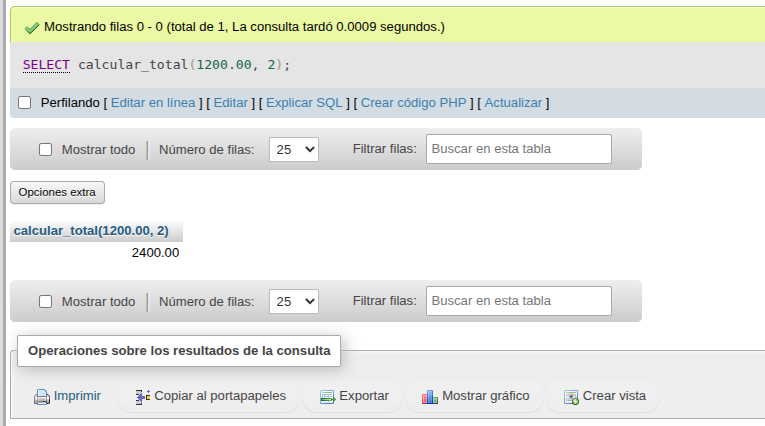
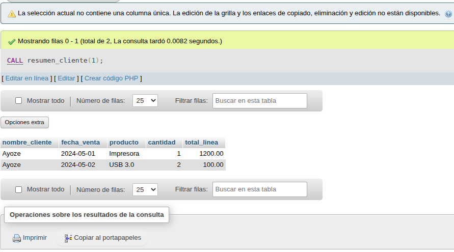
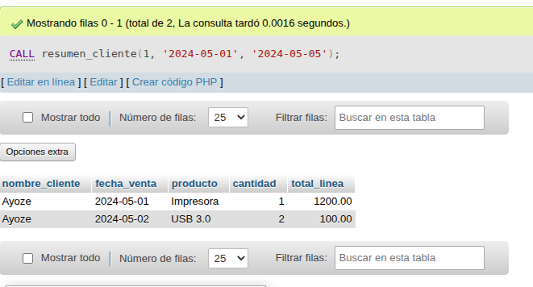
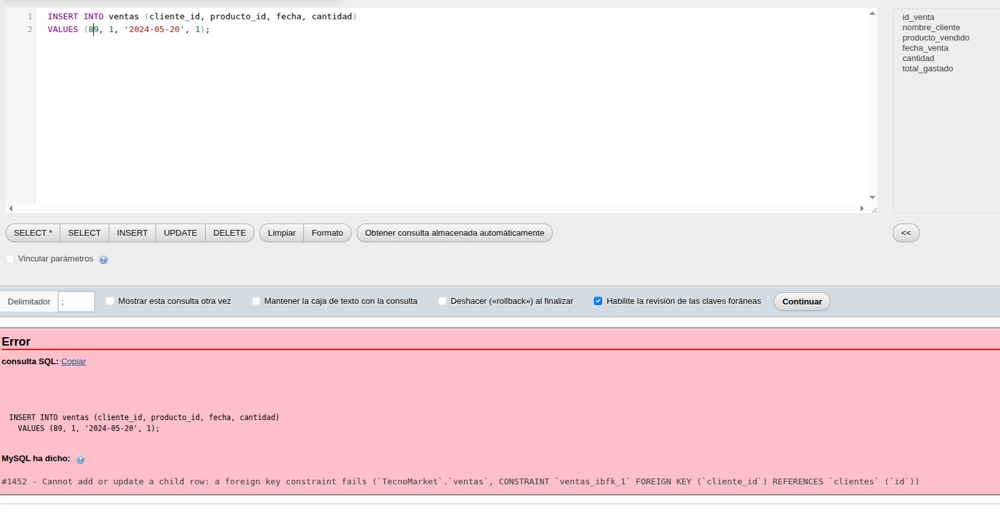
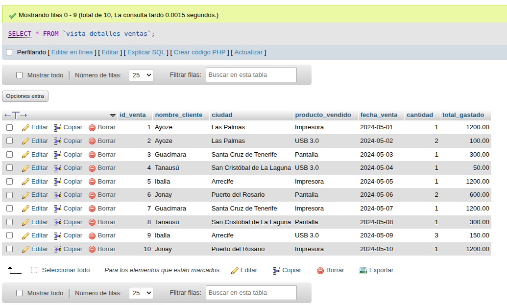
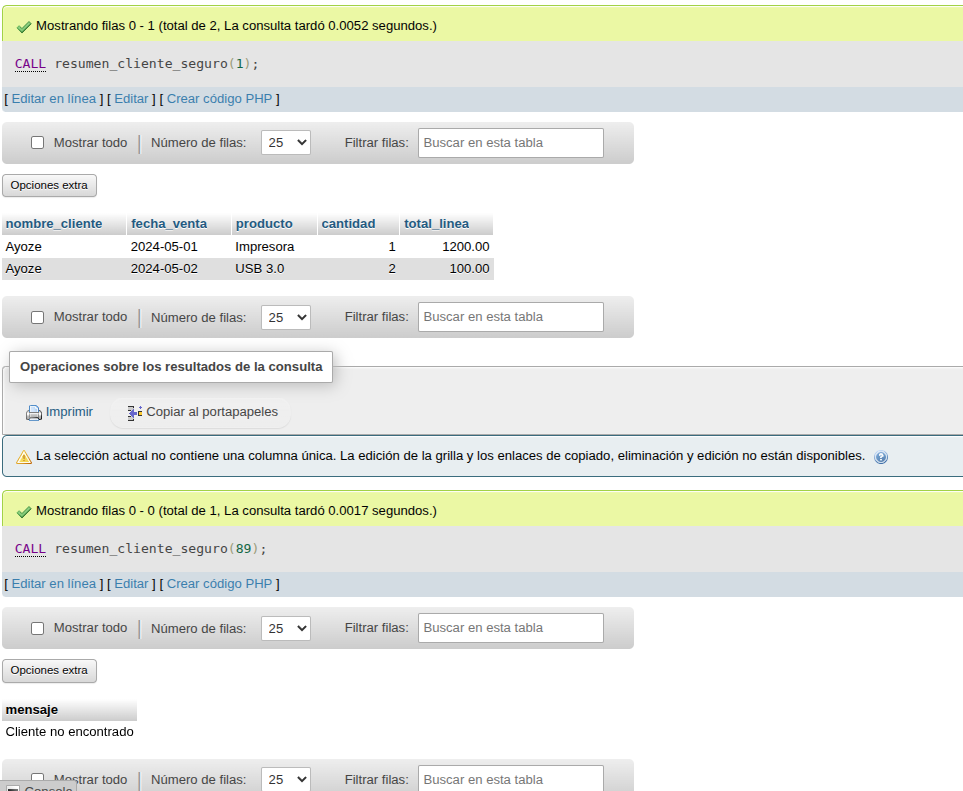

<div align="justify">

## 🧱 Enunciado del ejercicio

La empresa "TecnoMarket" quiere analizar las ventas realizadas por sus clientes. Para ello, necesita organizar la información en su base de datos y optimizar el rendimiento de las consultas.

### Tu tarea consiste en

1. Crear las tablas necesarias.
2. Insertar índices que mejoren las búsquedas más frecuentes.
3. Crear una vista que resuma las ventas.
4. Definir una función para calcular totales.
5. Crear un procedimiento que devuelva el resumen de ventas de un cliente específico.
6. Ejecutar el procedimiento para validar el resultado.

---

## 📘 Parte 1: Creación de tablas

- NOTA: He decidido cambiar un poco los datos para "jugar" un poco con la BBDD y seguir aprendiendo. Así que, en lugar de:

```sql
CREATE TABLE clientes (
    id INT AUTO_INCREMENT PRIMARY KEY,
    nombre VARCHAR(100),
    ciudad VARCHAR(50)
);

CREATE TABLE productos (
    id INT AUTO_INCREMENT PRIMARY KEY,
    nombre VARCHAR(100),
    precio DECIMAL(10, 2)
);

CREATE TABLE ventas (
    id INT AUTO_INCREMENT PRIMARY KEY,
    cliente_id INT,
    producto_id INT,
    fecha DATE,
    cantidad INT,
    FOREIGN KEY (cliente_id) REFERENCES clientes(id),
    FOREIGN KEY (producto_id) REFERENCES productos(id)
);
INSERT INTO productos (id, nombre, precio) VALUES
(1, 'Laptop', 1200.00),
(2, 'Teclado', 50.00),
(3, 'Monitor', 300.00);

INSERT INTO ventas (id, cliente_id, producto_id, fecha, cantidad) VALUES
(1, 1, 1, '2024-05-01', 1),
(2, 1, 2, '2024-05-12', 2),
(3, 2, 3, '2024-05-13', 1),
(4, 3, 2, '2024-05-14', 1);
```
- Lo que he hecho es generar TecnoMarket con la siguiente información:

```sql
    CREATE DATABASE IF NOT EXISTS TecnoMarket;
    USE TecnoMarket;

    CREATE TABLE clientes (
        id INT AUTO_INCREMENT PRIMARY KEY,
        nombre VARCHAR(100),
        ciudad VARCHAR(50)
    );

    CREATE TABLE productos (
        id INT AUTO_INCREMENT PRIMARY KEY,
        nombre VARCHAR(100),
        precio DECIMAL(10, 2)
    );

    CREATE TABLE ventas (
        id INT AUTO_INCREMENT PRIMARY KEY,
        cliente_id INT,
        producto_id INT,
        fecha DATE,
        cantidad INT,
        FOREIGN KEY (cliente_id) REFERENCES clientes(id),
        FOREIGN KEY (producto_id) REFERENCES productos(id)
    );

    INSERT INTO clientes (id, nombre, ciudad) VALUES
    (1, 'Ayoze', 'Las Palmas'),
    (2, 'Guacimara', 'Santa Cruz de Tenerife'),
    (3, 'Tanausú', 'San Cristóbal de La Laguna'),
    (4, 'Iballa', 'Arrecife'),
    (5, 'Jonay', 'Puerto del Rosario');

    INSERT INTO productos (id, nombre, precio) VALUES
    (1, 'Impresora', 1200.00),
    (2, 'USB 3.0', 50.00),
    (3, 'Pantalla', 300.00);

    INSERT INTO ventas (id, cliente_id, producto_id, fecha, cantidad) VALUES
    (1, 1, 1, '2024-05-01', 1),
    (2, 1, 2, '2024-05-02', 2),
    (3, 2, 3, '2024-05-03', 1),
    (4, 3, 2, '2024-05-04', 1),
    (5, 4, 1, '2024-05-05', 1),
    (6, 5, 3, '2024-05-06', 2),
    (7, 2, 1, '2024-05-07', 1),
    (8, 3, 3, '2024-05-08', 1),
    (9, 4, 2, '2024-05-09', 3),
    (10, 5, 1, '2024-05-10', 1);

```
---

## 🔍 Parte 2: Creación de índices

Crea los siguientes clientes:

- **idx_ciudad** sobre la tabla clientes y el campo ciudad.
    ```sql
        CREATE INDEX idx_ciudad ON clientes(ciudad);
    ```
- **idx_fecha** sobre la tabla ventas, y el campo fecha.
    ```sql
        CREATE INDEX idx_fecha ON ventas(fecha);
    ```

### ¿Preguntas?

- Crea los indices, muestra su rendimiento, y explica si son óptimos y por qué?.

```sql
    EXPLAIN SELECT * FROM clientes WHERE ciudad = 'Arrecife';

```



```sql
    EXPLAIN SELECT * FROM ventas WHERE fecha BETWEEN '2024-05-04' AND '2024-05-08';
```

---

- En principio, parecen óptimas puesto que si se realizasen bastantes consultas en dichas columnas (campos). Así, apuntar a idx_ciudad acelera la búsqueda si se consulta, de manera asidua, por ciudad. Por otro lado, idx_fecha permite filtrar más rápido por las fechas.
- NOTA: En el caso de que exista baja cardinalidad el rendimiento de las consultas podría ser más modesto.

## 👁️ Parte 3: Crear una vista

- **Obtén, a través de una vista**, la siguiente información detallada de cada venta:

- ID de la venta
- Nombre del cliente
- Producto vendido
- Fecha de la venta
- Cantidad comprada
- Total gastado (precio × cantidad)

La vista **vista** que consolida los datos de las tablas `ventas`, `clientes` y `productos`, permitiendo consultar fácilmente el historial de ventas detallado.

```sql

    CREATE VIEW vista_detalles_ventas AS
    SELECT 
        v.id AS id_venta,
        c.nombre AS nombre_cliente,
        p.nombre AS producto_vendido,
        v.fecha AS fecha_venta,
        v.cantidad,
        (p.precio * v.cantidad) AS total_gastado
    FROM ventas v
    JOIN clientes c ON v.cliente_id = c.id
    JOIN productos p ON v.producto_id = p.id;

```


---

## 🧮 Parte 4: Crear una función

Crea una **función almacenada** en MySQL llamada `calcular_total` que reciba los siguientes parámetros:

- `precio`: un valor decimal con dos decimales (precio del producto)
- `cantidad`: un número entero que representa las unidades compradas

La función debe devolver el resultado de multiplicar ambos valores, es decir, el **total a pagar** por esa línea de venta.

```sql
    DELIMITER //

    CREATE FUNCTION calcular_total(
        precio DECIMAL(10,2),
        cantidad INT
    )
    RETURNS DECIMAL(10,2)
    DETERMINISTIC
    BEGIN
        RETURN precio * cantidad;
    END //

    DELIMITER ;

```


---

## ⚙️ Parte 5: Crear un procedimiento

Crea un procedimiento llamado `resumen_cliente` que reciba como parámetro el **ID de un cliente** (`cliente_id`), y que devuelva el **historial de ventas** de dicho cliente.  
El procedimiento debe mostrar los siguientes datos por cada venta realizada por ese cliente:

- El **nombre del cliente**
- La **fecha de la venta**
- El **nombre del producto**
- La **cantidad comprada**
- El **total de la línea de venta**, calculado como `precio * cantidad`

💡 **Sugerencia:** Puedes reutilizar una función existente (como `calcular_total`) o calcular el total directamente en la consulta.

```sql
    DELIMITER $$

    CREATE PROCEDURE resumen_cliente(IN cliente_id INT)
    BEGIN
        SELECT 
            c.nombre AS nombre_cliente,
            v.fecha AS fecha_venta,
            p.nombre AS producto,
            v.cantidad,
            (p.precio * v.cantidad) AS total_linea
        FROM ventas v
        JOIN clientes c ON v.cliente_id = c.id
        JOIN productos p ON v.producto_id = p.id
        WHERE c.id = cliente_id;
    END $$

    DELIMITER ;

```


```sql
CALL resumen_cliente(1);
```

Con el siguiente resultado: 


---

## ❓ Preguntas teóricas

1. ¿Qué ventajas ofrece el uso de una vista en lugar de una consulta con múltiples `JOIN`?

    > La idea principal es la rapidez y organización de la salida de la consulta, ya que, las vistas permiten guardar la consulta como, digamos así, en una "tabla virtual". Realizamos la consulta con la vista y se gana en rendimiento sin necesidad de realizar múltiples consultas con JOIN, lo cual podría penalizar la base de datos si se diesen bastantes consultas.

2. ¿Por qué es importante declarar una función como `DETERMINISTIC`?

    > Cuando se usa esta función, le indicamos a si le damos los mismos valores de entrada, devuelva la misma salida (resultado). Dado que almacena en la caché algunos resultados ya dados, se favorece la rapidez en las consultas.

3. ¿Cuál es la diferencia entre una función y un procedimiento?

    > Una función suele devolver un valor y puede usarse dentro de una consulta como si fuese una operación matemática. Sin embargo, un procedimiento se usa para elaborar una serie de acciones sin necesidad de devolver ningún resultado (es como un void en Java).

4. ¿Qué impacto tienen los índices sobre el rendimiento de una base de datos?

    > Pueden ser como los índices de un libro, es decir, nos ayudan a encontrar información más rápido. Ahora bien, no podemos indexarlo todo porque se perjudica el rendimiento de las consultas y, además, al poner índices podemos penalizar, por ejemplo, las inserciones y modificaciones en la base de datos.

5. ¿Cuándo se recomienda usar un trigger en lugar de un procedimiento?

    > Cuando ocurre una inserción, modificación o eliminación de datos en una tabla y no se necesita que el usuario tenga que ejecutarla manualmente. En contraste, los prodecimientos deben ser llamados directamente para ejecutarse.

---

## 📝 Preguntas prácticas

1. Modifica el procedimiento para filtrar también por un rango de fechas.

```sql
    DROP PROCEDURE IF EXISTS resumen_cliente;

    DELIMITER $$

    CREATE PROCEDURE resumen_cliente(
        IN cliente_id    INT,
        IN fecha_inicio  DATE,
        IN fecha_fin     DATE
    )
    BEGIN
        SELECT 
            c.nombre        AS nombre_cliente,
            v.fecha         AS fecha_venta,
            p.nombre        AS producto,
            v.cantidad,
            (p.precio * v.cantidad) AS total_linea
        FROM ventas v
        JOIN clientes c ON v.cliente_id = c.id
        JOIN productos p ON v.producto_id = p.id
        WHERE c.id = cliente_id
        AND v.fecha BETWEEN fecha_inicio AND fecha_fin;
    END$$

    DELIMITER ;

```
- Para comprobarlo realizo lo siguiente:

```sql
    CALL resumen_cliente(1, '2024-05-01', '2024-05-05');
```


2. Crea un índice sobre la columna `producto_id` en la tabla `ventas`.

```sql
    CREATE INDEX idx_producto_id ON ventas(producto_id);
```


3. ¿Qué ocurre si insertas una venta con un `cliente_id` inexistente?

```sql
    INSERT INTO ventas (cliente_id, producto_id, fecha, cantidad)
    VALUES (89, 1, '2024-05-20', 1);
```


- Al intentar insertar, lanza un error como puede verse en la captura de pantalla anterior sobre restricción de clave foránea.

4. Modifica la vista para incluir también el nombre de la ciudad del cliente.

```sql

    CREATE OR REPLACE VIEW vista_detalles_ventas AS
    SELECT 
        v.id AS id_venta,
        c.nombre AS nombre_cliente,
        c.ciudad,
        p.nombre AS producto_vendido,
        v.fecha AS fecha_venta,
        v.cantidad,
        (p.precio * v.cantidad) AS total_gastado
    FROM ventas v
    JOIN clientes c ON v.cliente_id = c.id
    JOIN productos p ON v.producto_id = p.id;

```



5. Agrega una validación en el procedimiento para evitar resultados si el cliente no existe.

```sql
    DELIMITER $$

    CREATE PROCEDURE resumen_cliente_seguro(
        IN cliente_id INT
    )
    BEGIN
        IF EXISTS (SELECT 1 FROM clientes WHERE id = cliente_id) THEN
            SELECT 
                c.nombre AS nombre_cliente,
                v.fecha AS fecha_venta,
                p.nombre AS producto,
                v.cantidad,
                (p.precio * v.cantidad) AS total_linea
            FROM ventas v
            JOIN clientes c ON v.cliente_id = c.id
            JOIN productos p ON v.producto_id = p.id
            WHERE c.id = cliente_id;
        ELSE
            SELECT 'Cliente no encontrado' AS mensaje;
        END IF;
    END $$

    DELIMITER ;

```


---

</div>