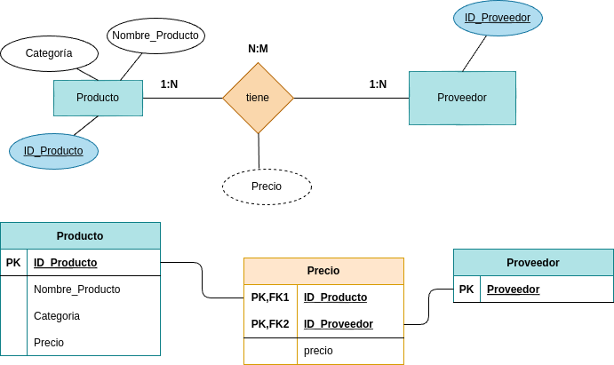

# Ejercicios de Normalización de Bases de Datos (1FN y 2FN).

> **IMP**: Genera las claves necesarias para corregir las tablas resultantes.

## **Ejercicio 1: Lista de Productos**

### **Tabla Inicial: Productos**

| ID_Producto | Nombre_Producto | Proveedores      | Categoría   | Precio |
|------------|----------------|-----------------|------------|--------|
| 1          | Laptop         | Dell, HP        | Tecnología | 1000   |
| 2          | Mouse          | Logitech        | Accesorios | 25     |

### **Tareas:**

1. Aplicar **1FN**, eliminando los valores multivaluados en "Proveedores".
2. Aplicar **2FN**, asegurando que cada campo dependa completamente de la clave primaria.

> Verifica generando el modelo Entidad/Relación

### **RESPUESTA:**
 Aplicando 1FN para asegurar que cada celda tenga datos atómicos y evitar repetición de datos.
  
***Tabla de Lista de Productos:***
| ID_Producto | Nombre_Producto | Categoría   | Precio |
|------------|----------------|-----------------|------------|
| 1          | Laptop         | Tecnología | 1000   |
| 2          | Mouse          | Accesorios | 25     |

Cuando se aplica 2FN, se asegura que proveedores dependa de la clave primaria (ID_Producto, en este caso).
 
***Nueva tabla de Proveedores***:
| ID_Producto | Proveedores      |
|------------|----------------|
| 1          | Dell            | 
| 1          | HP              |
| 2          | Logitech        |

  

---

## **Ejercicio 2: Pedidos de Clientes**

### **Tabla Inicial: Pedidos**

| ID_Pedido | Cliente   | Dirección       | Producto     | Cantidad | Precio |
|----------|----------|---------------|-------------|----------|--------|
| 101      | Juan Pérez | Calle 123     | Laptop      | 1        | 1000   |
| 102      | Ana López | Av. Central   | Teclado     | 2        | 50     |

### **Tareas:**

1. Aplicar **1FN**, separando valores repetidos y creando nuevas tablas si es necesario.
2. Aplicar **2FN**, asegurando que las dependencias parciales sean eliminadas.

> Verifica generando el modelo Entidad/Relación

### **RESPUESTA:**

 En este caso, parece que, aplicar la 1FN no se observan cambios porque no existen repetición de datos explícita y los datos de cada celda son atómicos.
  
***Tabla de Pedidos de Clientes:***
| ID_Pedido | Cliente   | Dirección       | Producto     | Cantidad | Precio |
|----------|----------|---------------|-------------|----------|--------|
| 101      | Juan Pérez | Calle 123     | Laptop      | 1        | 1000   |
| 102      | Ana López | Av. Central   | Teclado     | 2        | 50     |

Cuando se aplica 2FN, parece que la clave primaria es ID_Pedido. De esta PK dependen Cliente y Dirección. Ahora bien, Producto, Cantidad y Precio tienen una dependencia parcial puesto que aquellos dependen al mismo tiempo de ID_Pedido y del propio producto que el cliente pide. De esta manera, se pueden hacer las siguientes dos tablas:
 
***Nueva tablas: Pedido y Datos_producto***:
| ID_Pedido  | Cliente      | Dirección |
|------------|----------------|------------|
| 101        | Juan Pérez     | Calle 123  |
| 102        | Ana Pérez      | Av.Central |

| ID_Pedido  | Producto      | Cantidad | Precio |
|------------|---------------|------------|------|
| 101        | Laptop        |   1  | 1000  |
| 102        | Teclado       |   2  | 50    |

  
---

## **Ejercicio 3: Registro de Empleados**

### **Tabla Inicial: Empleados**

| ID_Empleado | Nombre     | Teléfonos         | Departamento |
|------------|------------|------------------|--------------|
| 1          | Carlos R.  | 12345, 67890     | Ventas       |
| 2          | Laura M.   | 54321            | Finanzas     |

### **Tareas:**

1. Aplicar **1FN**, eliminando los valores multivaluados en "Teléfonos".
2. Aplicar **2FN**, asegurando que cada atributo dependa completamente de la clave primaria.

> Verifica generando el modelo Entidad/Relación

### **RESPUESTA:**

 En este caso, se observa que teléfonos carece de datos atómicos. Se aplica 1FN y que la tabla de la siguiente manera:
  
***Tabla de Registro de empleados:***
| ID_Empleado | Nombre   | Teléfonos | Departamento     |
|----------|----------|-------------|-------------------|
| 1        | Carlos R.| 12345     | Ventas   |
| 1        | Carlos R.| 67890     | Ventas   |
| 2        | Laura M. | 54321     | Finanzas |

Cuando se aplica 2FN, teléfono depende de ID_Empleado (PK). No es necesario dividr más la tabla.
 

  
---

## **Ejercicio 4: Reservas de Hotel**

### **Tabla Inicial: Reservas**

| ID_Reserva | Cliente    | Habitación | Fechas              | Precio |
|------------|-----------|------------|---------------------|--------|
| 5001      | Pedro G.  | 101        | 01/02, 02/02, 03/02 | 300    |
| 5002      | María T.  | 202        | 10/03, 11/03       | 200    |

### **Tareas:**

1. Aplicar **1FN**, eliminando los valores multivaluados en "Fechas".
2. Aplicar **2FN**, asegurando que las dependencias parciales sean eliminadas.

> Verifica generando el modelo Entidad/Relación

### **RESPUESTA:**
 En este caso, se observa que las fechas no dispone de datos atómicos. Se aplica 1FN y que la tabla de la siguiente manera:
  
***Tabla de Reservas de Hotel:***
| ID_Reserva | Cliente    | Habitación | Fecha  | Precio |
|------------|-----------|------------|---------|--------|
| 5001      | Pedro G.  | 101        | 01/02 | 300    |
| 5001      | Pedro G.  | 101        | 02/02 | 300    |
| 5001      | Pedro G.  | 101        | 03/02 | 300    |
| 5002      | María T.  | 202        | 10/03 | 200    |
| 5002      | María T.  | 202        | 11/03 | 200    |

Cuando se aplica 2FN, teléfono depende de ID_Empleado (PK). No es necesario dividr más la tabla. Considero que Fecha tiene una dependencia parcial tanto de ID_Reserva como de Habitación. Las tablas quedan de la siguiente forma:
 
***Nueva tablas: Reserva y Fecha_reserva***:
| ID_Reserva  | Cliente     | Habitacion | Precio |
|------------|--------------|------------|--------|
| 5001       | Pedro G.     | 101        | 300    |
| 5002       | María T.      | Av.Central |

| ID_Reserva  |    Fecha    |
|------------|--------------|
| 5001       | 01/02        |   
| 5001       | 02/02        | 
| 5001       | 03/02        | 
| 5002       | 10/03        | 
| 5002       | 11/03        | 

  
---

## **Ejercicio 5: Inscripciones a Cursos**

### **Tabla Inicial: Inscripciones**

| ID_Inscripción | Estudiante | Curso        | Profesor    | Horarios |
|---------------|------------|--------------|------------|----------|
| 3001         | Luis R.    | Matemáticas  | Prof. Pérez | Lunes 10AM, Miércoles 2PM |
| 3002         | Ana S.     | Física       | Prof. Gómez | Martes 3PM |

### **Tareas:**

1. Aplicar **1FN**, eliminando valores multivaluados en "Horarios".
2. Aplicar **2FN**, asegurando que cada campo dependa completamente de la clave primaria.

> Verifica generando el modelo Entidad/Relación

### **RESPUESTA:**

 En este caso, los valores de los horarios no son atómicos. Se aplica la 1FN y queda la siguiente tabla:
  
***Tabla de Inscripciones a cursos***
| ID_Inscripción | Estudiante | Curso        | Profesor    | Horarios |
|---------------|------------|--------------|------------|----------|
| 3001         | Luis R.    | Matemáticas  | Prof. Pérez | Lunes 10AM |
| 3001         | Luis R.    | Matemáticas  | Prof. Pérez | Miércoles 2PM |
| 3002         | Ana S.     | Física       | Prof. Gómez | Martes 3PM |

Cuando se aplica 2FN, parece que la clave primaria es ID_Inscripción. Horario depende parcialmente de ID_Inscripción De esta manera, se pueden hacer las siguientes dos tablas:
 
***Nueva tablas: Inscripciones a cursos***:
| ID_Inscripción | Estudiante | Curso        | Profesor    |
|---------------|------------|--------------|------------|
| 3001         | Luis R.    | Matemáticas  | Prof. Pérez |
| 3002         | Ana S.     | Física       | Prof. Gómez |

| ID_Inscripción  |    Horario    |
|------------|--------------|
| 3001       | Lunes 10AM        |   
| 3001       | Miércoles 2PM     | 
| 3002       | Martes 3PM        | 

  

---
## **Ejercicio 6: Ventas de Tienda**

### **Tabla Inicial: Ventas**

| ID_Venta | Cliente    | Productos Comprados | Total |
|----------|------------|---------------------|-------|
| 8001     | Juan P.   | Celular, Funda      | 500   |
| 8002     | Andrea M. | Laptop              | 1000  |

### **Tareas:**

1. Aplicar **1FN**, separando valores multivaluados en "Productos Comprados".
2. Aplicar **2FN**, asegurando que cada atributo dependa completamente de la clave primaria.

> Verifica generando el modelo Entidad/Relación

### **RESPUESTA:**

 En este caso, los valores de los productos comprados no son atómicos. Se aplica la 1FN y queda la siguiente tabla:
  
***Tabla de Ventas de Tienda***
| ID_Venta | Cliente    | Productos Comprados | Total |
|----------|------------|---------------------|-------|
| 8001     | Juan P.   | Celular    | 500   |
| 8001     | Juan P.   | Funda      | 500   |
| 8002     | Andrea M. | Laptop     | 1000  |

Cuando se aplica 2FN, parece que la clave primaria es ID_Inscripción. Horario depende parcialmente de ID_Inscripción De esta manera, se pueden hacer las siguientes dos tablas:
 
***Nueva tablas: Ventas de Tienda***:
| ID_Venta | Cliente | Total |
|---------------|------------|--------------|
| 8001         | Juan P.    | 500  |
| 8002         | Andrea M.  | 1000 |

| ID_Venta  |    Producto    |
|------------|--------------|
| 8001       | Celular   |   
| 8001       | Funda     | 
| 8001       | Laptop    | 

  

---

## **Ejercicio 7: Biblioteca de Libros**

### **Tabla Inicial: Libros**

| ID_Libro | Título | Autores          | Género  |
|----------|--------|-----------------|---------|
| 101      | El Quijote | Cervantes   | Novela  |
| 102      | 1984       | Orwell       | Ciencia Ficción |

### **Tareas:**

1. Aplicar **1FN**, eliminando valores multivaluados en "Autores".
2. Aplicar **2FN**, asegurando que cada atributo dependa completamente de la clave primaria.

> Verifica generando el modelo Entidad/Relación

### **RESPUESTA:**

 En este caso, se puede entender que un libro puede tener varios autores y por ello podría haber más de un dato por cada autor incumpliendo la 1FN. Por tanto, se aplica la 1FN obteniéndose la siguiente en la misma tabla:
  
***Tabla de Biblioteca de Libros:***
| ID_Libro | Título | Autores          | Género  |
|----------|--------|-----------------|---------|
| 101      | El Quijote | Cervantes   | Novela  |
| 102      | 1984       | Orwell       | Ciencia Ficción |

Si, por ejemplo, se añadiese un tercer libro (103, Manual de Psicología, McKay y Davis, Ensayo), tras aplicar la 1FN quedaría siguiente tabla hipotética:

***Tabla de Biblioteca de Libros (hipotética):***
| ID_Libro | Título | Autores          | Género  |
|----------|--------|-----------------|---------|
| 101      | El Quijote | Cervantes   | Novela          |
| 102      | 1984       | Orwell      | Ciencia Ficción |
| 103      | Manual de Psicología     | McKay  | Ensayo |
| 103      | Manual de Psicología     | Davis  | Ensayo |

Cuando se aplica 2FN, la clave primaria es ID_Libro. Se separa Autor porque, por ejemplo, un libro puede tener varios autores.De esta manera, se pueden hacer las siguientes dos tablas:
 
***Nueva tablas: Biblioteca de Libros***:
| ID_Libro  | Titulo      | Género |
|------------|----------------|------------|
| 101        | El Quijote    | Novela          |
| 102        | 1984          | Ciencia Ficción |

| ID_Libro  | Autor      |
|------------|---------------|
| 101        | Cervantes     |
| 102        | Orwell        | 

  

---

## **Ejercicio 8: Facturación de Servicios**

### **Tabla Inicial: Facturas**

| ID_Factura | Cliente   | Servicios Contratados | Costo Total |
|------------|-----------|----------------------|-------------|
| 9001       | Juan P.   | Internet, TV        | 50          |
| 9002       | Ana M.    | Teléfono            | 20          |

### **Tareas:**

1. Aplicar **1FN**, separando valores multivaluados en "Servicios Contratados".
2. Aplicar **2FN**, asegurando que cada atributo dependa completamente de la clave primaria.

> Verifica generando el modelo Entidad/Relación

### **RESPUESTA:**

 En este caso, Servios contratados tiene más valores que incumplen 1FN (no son atómicos). Por tanto, se aplica la 1FN obteniéndose la siguiente en la misma tabla:
  
***Tabla de Facturación de Servicios:***
| ID_Factura | Cliente   | Servicios Contratados | Costo Total |
|------------|-----------|----------------------|-------------|
| 9001       | Juan P.   | Internet  | 50          |
| 9001       | Juan P.   | TV        | 50          |
| 9002       | Ana M.    | Teléfono  | 20          |

Cuando se aplica 2FN, la clave primaria es ID_Factura. Se separa Servicio porqu podría estar vinculado a un detalla específico de la factura.De esta manera, se pueden hacer las siguientes dos tablas:
 
***Nueva tablas: Facturación de Servicios***:
| ID_Factura  | Cliente      | Costo_Total |
|------------|----------------|------------|
| 9001       | Juan P.        | 50     |
| 9002       | Ana M.         | 20     |

| ID_Factura  | Servicio      |
|------------|---------------|
| 9001        | Internet     |
| 9001        | TV           |
| 9002        | Telefono     | 

  

---

## **Ejercicio 9: Gestión de Vehículos**

### **Tabla Inicial: Vehículos**

| ID_Vehículo | Marca   | Modelos          | Año |
|------------|--------|----------------|-----|
| 5001       | Toyota  | Corolla, Yaris  | 2022 |
| 5002       | Honda   | Civic          | 2023 |

### **Tareas:**

1. Aplicar **1FN**, eliminando valores multivaluados en "Modelos".
2. Aplicar **2FN**, asegurando que cada atributo dependa completamente de la clave primaria.

> Verifica generando el modelo Entidad/Relación

### **RESPUESTA:**

 En este caso, la columna modelos ofrece datos que no son atómicos. Tras aplicar la 1FN se obtiene lo siguiente:
  
***Tabla de Gestión de Vehículos:***
| ID_Vehículo | Marca   | Modelos          | Año |
|------------|--------|----------------|-----|
| 5001       | Toyota  | Corolla | 2022 |
| 5001       | Toyota  | Yaris   | 2022 |
| 5002       | Honda   | Civic   | 2023 |

Cuando se aplica 2FN, parece que la clave primaria es ID_Vehiculo. Por otra parte, Modelo podemos ponerlo en una tabla aparte. De esta manera, se pueden hacer las siguientes dos tablas:
 
***Nueva tablas: Gestión de Vehículos***:
| ID_Vehiculo  | Marca      | Año |
|------------|----------------|------------|
| 5001       | Toyota   | 2022  |
| 5001       | Honda    | 2023  |

| ID_Vehiculo  | Modelo      |
|------------|---------------|
| 5001        | Corolla     |
| 5001        | Yaris       |
| 5002        | Civic       | 

  

---

## **Ejercicio 10: Gestión de Proyectos**

### **Tabla Inicial: Proyectos**

| ID_Proyecto | Nombre       | Miembros        | Presupuesto |
|------------|-------------|----------------|------------|
| 7001       | Web App     | Juan, Ana      | 5000       |
| 7002       | E-commerce  | Pedro, María   | 10000      |

### **Tareas:**

1. Aplicar **1FN**, eliminando valores multivaluados en "Miembros".
2. Aplicar **2FN**, asegurando que cada atributo dependa completamente de la clave primaria.

> Verifica generando el modelo Entidad/Relación

### **RESPUESTA:**

 En este caso, parece que Miembros tiene distintos valores y al aplicar la 1FN para conseguri que sean atómicos, se obtiene la siguiente tabla:
  
***Tabla de Gestión de Proyectos:***
| ID_Proyecto | Nombre       | Miembros        | Presupuesto |
|------------|-------------|----------------|------------|
| 7001       | Web App     | Ana      | 5000       |
| 7001       | Web App     | Ana      | 5000       |
| 7002       | E-commerce  | María    | 10000      |
| 7002       | E-commerce  | Pedro    | 10000      |

Cuando se aplica 2FN, parece que la clave primaria es ID_Proyect. Sin embargo, Miembro podría estar vinculado a aspectos específicos del proyecto, es decir, puede tener dependencia parcial. De esta manera, se pueden hacer las siguientes dos tablas:
 
***Nueva tablas: Gestión de Proyectos***:
| ID_Proyecto  | Nombre      | Presupuesto |
|------------|----------------|------------|
| 7001       | Web App        | 5000  |
| 7002       | E-commerce     | 10000 |

| ID_Proyecto  | Miembro      |
|------------|---------------|
| 7001      | Juan     |
| 7001      | Ana      |
| 7002      | Pedro    |
| 7002      | María    |

  
  
---

 

[def]: mages/ejercicio1.drawio.pn