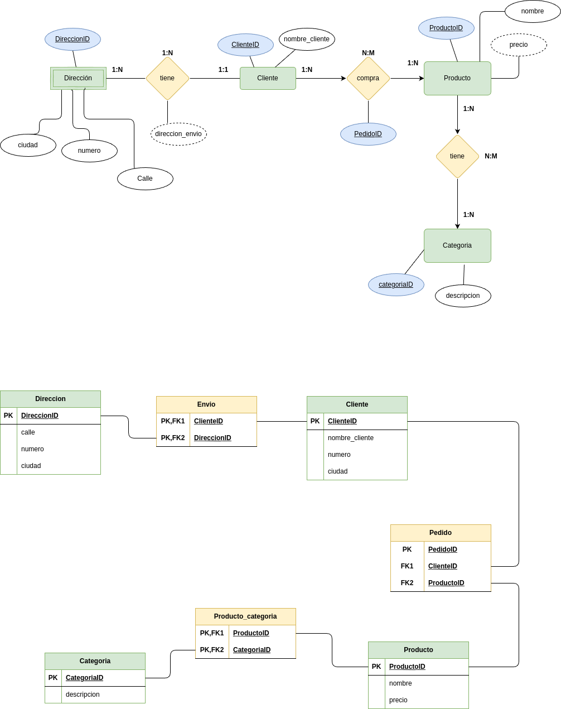

# Ejercicio para practicar Normalización (1FN, 2FN y 3FN) con "Tienda de productos":

# 

La siguiente tabla muestra la información de una tienda con sus productos.

## Base de Datos No Normalizada: Tienda

| ProductoID | Nombre          | Categorias                  | Precio | ClienteID | NombreCliente | DireccionesEnvio                    |
|------------|-----------------|-----------------------------|--------|-----------|---------------|-------------------------------------|
| 1          | Laptop HP       | Electrónicos, Informática   | 800    | 101       | Juan          | Calle 1, Ciudad A / Calle 2, Ciudad A |
| 2          | Camiseta Nike    | Ropa, Deportes              | 30     | 102       | María         | Calle 3, Ciudad B                    |
| 3          | Libro "Dune"     | Libros, Ciencia Ficción     | 20     | 101       | Juan          | Calle 1, Ciudad A                     |

Se pide:

- Verifica y transforma a __1FN__ justificando la respuesta.
 
### RESPUESTA:
 
Se aplica la 1FN para asegurar que todos los datos sean atómicos. Categorías se encuentra con varios valores al igual que las direcciones de envío en el cliente 101 (Juan), tras aplicarse la 1FN, la tabla queda de la sigueinte manera:

| ProductoID | Nombre          | Categorias                  | Precio | ClienteID | NombreCliente | DireccionesEnvio     |
|------------|-----------------|-----------------------------|--------|-----------|---------------|-----------------------|
| 1          | Laptop HP       | Electrónicos                | 800    | 101       | Juan          | Calle 1, Ciudad A     |
| 1          | Laptop HP       | Informática                 | 800    | 101       | Juan          | Calle 2, Ciudad A     |
| 2          | Camiseta Nike   | Ropa                        | 30     | 102       | María         | Calle 3, Ciudad B     |
| 2          | Camiseta Nike   | Deportes                    | 30     | 102       | María         | Calle 3, Ciudad B     |
| 3          | Libro "Dune"    | Libros                      | 20     | 101       | Juan          | Calle 1, Ciudad A     |
| 3          | Libro "Dune"    | Ciencia Ficción             | 20     | 101       | Juan          | Calle 1, Ciudad A     |

- Verifica y transforma a __2FN__ justificando la respuesta.
 
### RESPUESTA:
 
Para aplicar la 2FN, la tabla debe estar en 1FN y es necesario delimitar qué atributos son los que dependen por completo de la clave primaria (en este caso, ProductoID). Para ello, se crean las siguientes tablas que evitan la aparición de dependencias parciales:
 
Entiendo que Nombre y Precio dependen de ProductoID; que NombreCliente y DireccionesEnvio dependen de ClienteID; y que, finalmente, Categoría depende de ProductoID. Categorías necesita una tabla intermedia porque tiene una relación de N:M (un producto puede tener muchas categorías y una categoría puede  contener varios productos). Además, el Cliente hace una compra o pedido que también debe tener su tabla al ser una relación N:M. De esta manera, elabora las siguientes tablas:

***Tabla de Producto***
| ProductoID | Nombre          | Precio |
|------------|-----------------|--------|
| 1          | Laptop HP       | 800    | 
| 1          | Laptop HP       | 800    |
| 2          | Camiseta Nike   | 30     |
| 2          | Camiseta Nike   | 30     | 
| 3          | Libro "Dune"    | 20     |
| 3          | Libro "Dune"    | 20     |

***Tabla de Cliente***
| ClienteID | NombreCliente | DireccionesEnvio  |
|-----------|---------------|--------------------|
| 101       | Juan          | Calle 1, Ciudad A |
| 101       | Juan          | Calle 2, Ciudad A |
| 102       | María         | Calle 3, Ciudad B |
| 102       | María         | Calle 3, Ciudad B |
| 101       | Juan          | Calle 1, Ciudad A |
| 101       | Juan          | Calle 1, Ciudad A |

***Tabla de Categoría***
| CategoriaID | Descripcion_Categoria  |
|------------|----------------------------------| 
| 501        | Electrónicos                |
| 502        | Informática                 | 
| 503        | Ropa                        | 
| 504        | Deportes                    | 
| 505        | Libros                      | 
| 506        | Ciencia Ficción             | 

***Tabla relacionada con Producto y Categoría***
| ProductoID  |   CategoriaID | 
|-------------|---------------| 
| 1           |      501      |    
| 1           |      502      | 
| 2           |      503      | 
| 2           |      504      |  
| 3           |      505      |  
| 3           |      506      |  

***Tabla de Pedido***
| ProductoID | ClienteID | DireccionesEnvio     |
|------------|-----------|----------------------|
| 1          | 101       | Calle 1, Ciudad A     |
| 1          | 101       | Calle 2, Ciudad A     |
| 2          | 102       | Calle 3, Ciudad B     |
| 2          | 102       | Calle 3, Ciudad B     |
| 3          | 101       | Calle 1, Ciudad A     |
| 3          | 101       | Calle 1, Ciudad A     |

Ahora bien, en DireccionesEnvio se observa que un ClienteID podría tener múltiples direcciones a las que enviar su pedido. Entonces, es más eficiente asignar un ID a las direcciones quedando de la siguiente forma:

***Tabla de Dirección***
| DireccionID | DireccionEnvio     |
|------------|----------------------|
| 301        | Calle 1, Ciudad A    |
| 302        | Calle 2, Ciudad A    |
| 303        | Calle 3, Ciudad B    |

***Nueva Tabla de Pedido***
| PedidoID  | ProductoID | ClienteID | DireccionID  |
|-----------|------------|-----------|--------------|
| 4001      |   1        | 101       |     301     |
| 4002      |   1        | 101       |     302     |
| 4003      |   2        | 102       |     303     |
| 4004      |   2        | 102       |     303     |
| 4005      |   3        | 101       |     301     |
| 4006      |   3        | 101       |     301     |

- Verifica y transforma a __3FN__ justificando la respuesta.
 
### RESPUESTA:
Tras la realización de la anterior 2FN no observo dependencias parciales ni transitivas.

### A continuación, expongo el diagrama de Entidad-Relación y Modelo Relacional:

  

 
